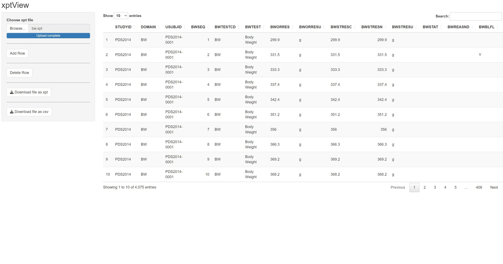

## xptView
xptView shiny app can be use to
- Read xpt file and view the table
- edit specific value in the table
- add rows
- delete rows
- download after editing the table

## workflow

read xpt file from your system  
  

### add row
to add row, hit add row button.  
this will add a row at the top of the table. By default, it copies the last row
from the table. You need to edit by clicking on the cell.  
### delete row
one or more rows can be deleted at once.
first select row/rows you want to delete in the table. Then 
hit delete row button.  
  

### download
after editing, table can be downloaded as xpt file.

